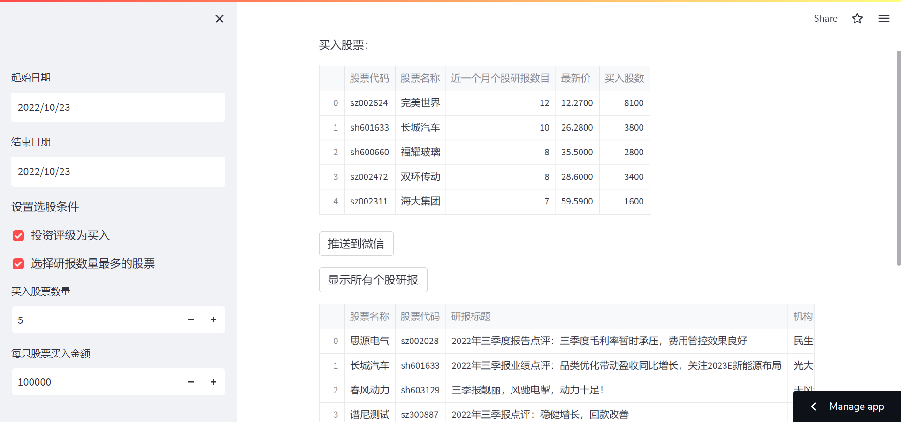
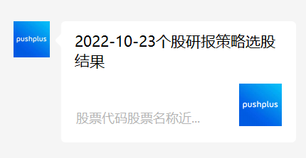
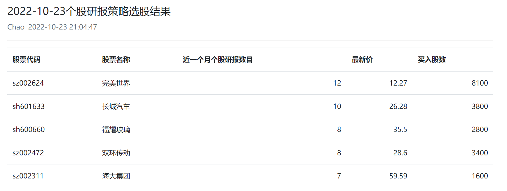

[](https://jeremy-feng-stock-research-strategy-app-0bkacc.streamlitapp.com/) 

策略逻辑：选择当天发布的研报中评级为“买入”（最高评级）的股票，按照“近一个月个股研报数目”降序排列，选择前若干只股票进行等权买入。

将策略代码部署到`Streamlit`上，定期执行事件选股策略并将选股结果推送到微信，可以大大节省重复运行策略代码的时间，提高交易的执行效率。

[演示地址](https://jeremy-feng-stock-research-strategy-app-0bkacc.streamlitapp.com/)



## 东方财富网个股研报数据爬虫

```python
from urllib.request import urlopen  # python自带爬虫库
import json  # python自带的json数据库
import pandas as pd
import time
import datetime

def change(x):
    if x[:1] == '6' or x[:3] == '900':
        return 'sh' + x
    elif x[:2] == '00' or x[:2] == '30' or x[:3] == '200':
        return 'sz' + x
    else:
        return x

def get_research_report_data(begin_time, until_time):
    """
    获取个股研报历史数据，设置起始时间和结束时间
    :param until_time:
    :param begin_time: 起始时间 格式为'2020-06-01'
    :param until_time: 起始时间 格式为'2020-06-01'
    :return:
    """
    # http://data.eastmoney.com/report/stock.jshtml
    if len(begin_time.split("-")) != 3:
        print("begin_tiem_str 格式有误 格式为’%Y-%m-%d‘")
        return None

    try:
        ts = int(time.time() * 1000)
        if until_time is None:
            until_time = now_date.strftime("%Y-%m-%d")
        pageNum = 1
        data = []

        while True:
            url_1 = "http://reportapi.eastmoney.com/report/list?cb=datatable4263982&industryCode=*&pageSize=100&industry=*&rating=*&ratingChange=*&beginTime=%s&endTime=%s&pageNo=%d&fields=&qType=0&orgCode=&code=*&rcode=&_=%d"
            url_stockResearch = url_1 % (begin_time, until_time, pageNum, ts)
            content = urlopen(url_stockResearch).read().decode("utf-8")

            content = content.split("(", maxsplit=1)[-1][:-1]  # 去掉括号
            # content_0 = content_0.split(")", maxsplit=1)[0]  # 去掉右括号
            content_1 = json.loads(content)  # 自己去仔细看下这里面有什么数据
            if content_1["data"]:
                df = pd.DataFrame(content_1["data"])
            else:
                print('今日个股研报无数据')
                break
            df_0 = df[
                ["stockName", "stockCode", "title", "orgName", "orgSName", "predictThisYearPe", "predictThisYearEps",
                 "predictNextYearPe", "predictNextYearEps", "predictNextTwoYearPe", "predictNextTwoYearEps",
                 "indvInduName", "indvInduCode", "emRatingName", "lastEmRatingName", "count",
                 "publishDate"]].copy()
            df_0.rename(columns={
                "stockName": "股票名称",
                "stockCode": "股票代码",
                "title": "研报标题",
                "orgName": "机构",
                "orgSName": "机构名称",
                "predictThisYearPe": "预测今年市盈率",
                "predictThisYearEps": "预测今年每股收益",
                "predictNextYearPe": "预测明年市盈率",
                "predictNextYearEps": "预测明年每股收益",
                "predictNextTwoYearPe": "预测后年市盈率",
                "predictNextTwoYearEps": "预测后年每股收益",
                "indvInduName": "行业名称",
                "indvInduCode": "行业代码",
                "emRatingName": "评级",
                "lastEmRatingName": "上次评级",
                "count": "近一个月个股研报数目",
                "publishDate": "发布日期"
            }, inplace=True)
            data.append(df_0)
            print("已爬取第%d页，当前页有%d行数据" % (pageNum, len(df_0)))
            pageNum += 1
            time.sleep(1)
        if not data:
            return None
        else:
            total = pd.concat(data, ignore_index=True)
            total['股票代码'] = total['股票代码'].apply(lambda x: change(x))
            return total
    except Exception as e:
        print("报错，报错内容：", str(e))
        return None
```

### 获取指定日期范围的个股研报数据（默认为当日）

```python
now_date = datetime.datetime.now()
begin_time = st.sidebar.date_input(
    "起始日期",
    now_date)
until_time = st.sidebar.date_input(
    "结束日期",
    now_date)

begin_time_str = begin_time.strftime("%Y-%m-%d")
until_time_str = until_time.strftime("%Y-%m-%d")

data = get_research_report_data(begin_time_str, until_time_str)
```

## 通过`Akshare`获取股票最新行情数据

```python
import akshare as ak

def get_price():
    return ak.stock_zh_a_spot_em()
```

## 设置选股条件

```python
st.sidebar.write('设置选股条件')
# 设置选股条件，对股票进行筛选
condition = None
# 评级为最高等级的买入
if st.sidebar.checkbox("投资评级为买入", True):
    condition = (data['评级'] == '买入')
# 应用选股条件
selected_stock = data[condition]
if st.sidebar.checkbox("选择研报数量最多的股票", True):
    selected_stock = selected_stock.sort_values(by='近一个月个股研报数目', ascending=False)
# 删除重复的股票
selected_stock.drop_duplicates(subset=['股票代码'],keep='first', inplace=True)
# 重新索引
selected_stock.index = range(len(selected_stock))

# 设置买入股票数量
buy_num = st.sidebar.number_input("买入股票数量", 1, None, 5)
# 求出买入股票的代码和名称
buy_stock = selected_stock[['股票代码', '股票名称', '近一个月个股研报数目']][:buy_num]
```

## 结合最新价，计算应买入的股票数量

```python
# 每只股票买入金额
buy_money = st.sidebar.number_input("每只股票买入金额", 1, None, 100000, 10000)
# 删除代码中的前缀
buy_stock['代码'] = buy_stock['股票代码'].apply(lambda x: x[2:])
# 获取股票的实时数据
price = get_price()
# 将最新价合并到买入股票的代码和名称中
buy_stock = pd.merge(buy_stock, price, on='代码', how='left')
# 计算每只股票买入的股数
buy_stock['买入股数'] = buy_stock['最新价'].apply(lambda x: int((buy_money // x) // 100 * 100))
```

## 通过`pushplus`推送到微信

```python
# 开始推动到pushplus
if st.button("推送到微信"):
    # 推送标题
    title= now_date.strftime("%Y-%m-%d") + "个股研报策略选股结果"
    # 将buy_stock转换为markdown格式
    buy_stock_md = buy_stock.to_markdown(index=False)
    # 推送内容
    content = buy_stock_md
    template = 'markdown'
    headers = {'Content-Type':'application/json'}
    url = 'http://www.pushplus.plus/send?token='+token+'&title='+title+'&content='+content+'&template='+template
    requests.get(url)
    st.success("推送成功")
```

推送到微信：



点击消息后可看到选股结果表格：


